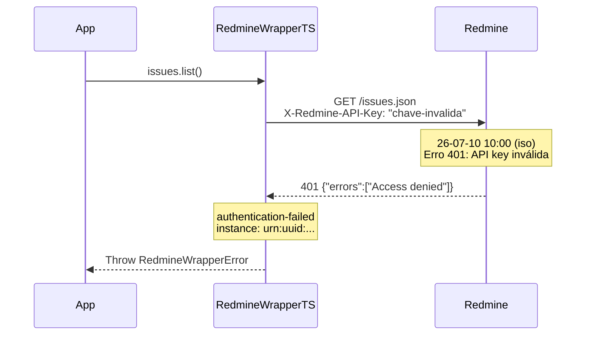

# Erro: `authentication-failed` (401 Unauthorized)



O erro `authentication-failed` ocorre quando a API key fornecida é inválida, ausente, ou quando a API REST do Redmine não está habilitada no servidor.

## 🛠️ Como ocorre

1. **API Key Incorreta:** A chave fornecida na configuração não corresponde a nenhum usuário válido.
2. **API REST Desabilitada:** O administrador do Redmine não ativou "Enable REST API" em *Administration → Settings → API*.
3. **Key Expirada ou Revogada:** A API key foi regenerada ou desativada após a configuração.
4. **Header Ausente:** O header `X-Redmine-API-Key` não está sendo enviado (problema de interceptação de rede ou proxy).

## 💻 Exemplos de Código

### Exemplo 1: Chave Incorreta

```typescript
const sdk = RedmineWrapperTS.create({
    baseUrl: "https://redmine.example.com",
    apiKey: "chave-incorreta-aqui",  // Não corresponde a nenhum usuário
});

try {
    await sdk.myAccount.get();
} catch (err) {
    if (err instanceof RedmineWrapperError) {
        console.error(`[${err.instance}] Falha de autenticação: ${err.detail}`);
        // → "Access denied"
    }
}
```

### Exemplo 2: API REST Desabilitada

O Redmine retorna 401 mesmo com a chave correta se a API REST não estiver habilitada:
```
Administration → Settings → API → ☑ Enable REST API
```

### Exemplo 3: Múltiplas Instâncias com diferentes credenciais

```typescript
const sdkValido = RedmineWrapperTS.create({
    baseUrl: "https://redmine.example.com",
    apiKey: Deno.env.get("REDMINE_KEY_PROD")!,
});

const sdkInvalido = RedmineWrapperTS.create({
    baseUrl: "https://redmine.example.com",
    apiKey: "chave-antiga",  // Foi regenerada
});
```

## ✅ O que fazer

- **Verificar a chave:** Acesse `/my/account` no Redmine e confirme a API key exibida no painel direito.
- **Gerar nova chave:** Se necessário, clique em "Show" ou "Generate" para criar uma nova chave.
- **Ativar REST API:** Confirme com o administrador que "Enable REST API" está ativado.
- **Testar com curl:** Isole o problema testando diretamente com curl:
  ```bash
  curl -H "X-Redmine-API-Key: sua-chave" \
    https://redmine.example.com/my/account.json
  ```
  Se o curl falhar com 401, o problema é no servidor ou na chave.

## 🧠 Reflexão Técnica: Por que não há retry automático?

Diferente de erros como `rate-limited` ou `timeout`, o erro `authentication-failed` indica um **erro de configuração** que não será resolvido com uma simples repetição da requisição. Tentar retry automático para 401 apenas aumentaria a carga no servidor sem nenhum benefício, potencialmente agravando o problema ao gerar múltiplos logs de erro para a mesma causa raiz.

A abordagem correta é **corrigir a configuração** e reiniciar o processo. O UUIDv7 único no campo `instance` permite rastrear exatamente qual requisição falhou e em qual instância do SDK, facilitando a correlação com logs de deploy ou mudanças de configuração.

---

## 🔗 Veja também

- [**Guia de Erros**](./errors.md): Lista completa de exceções.
- [**Getting Started**](../getting-started.md): Como configurar a API key corretamente.
- [**Particularidades da API**](../particularities.md): Impersonação apenas para admin.

---

[↑ Voltar ao índice](./errors.md)
