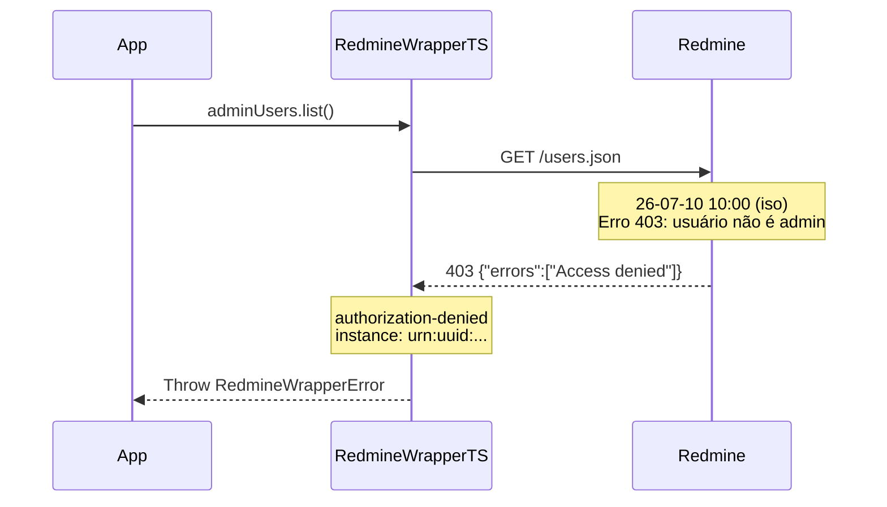

# Erro: `authorization-denied` (403 Forbidden)



O erro `authorization-denied` ocorre quando o usuário autenticado não tem permissão para acessar o recurso ou executar a operação solicitada.

## 🛠️ Como ocorre

1. **Projeto Privado:** Tentativa de acessar um projeto privado sem ser membro.
2. **Role Sem Permissão:** O papel do usuário não inclui a permissão necessária (ex: apenas "Reporter" tentando gerenciar membros).
3. **Endpoint Restrito:** Tentativa de acessar endpoints que exigem privilégios de administrador (ex: `GET /users.json`, `GET /groups.json`).
4. **Módulo Desabilitado:** O módulo necessário não está habilitado no projeto (ex: time tracking desabilitado).

## 💻 Exemplos de Código

### Exemplo 1: Usuário Não-Admin Tentando Listar Usuários

```typescript
const sdk = RedmineWrapperTS.create({
    baseUrl: "https://redmine.example.com",
    apiKey: "chave-de-usuario-nao-admin",
});

try {
    const users = await sdk.users.list().toArray();
} catch (err) {
    if (err instanceof RedmineWrapperError) {
        console.error(`[${err.instance}] Sem permissão: ${err.detail}`);
        // Apenas admins podem listar usuários
    }
}
```

### Exemplo 2: Acesso a Projeto Privado Sem Ser Membro

```typescript
const sdk = RedmineWrapperTS.create({
    baseUrl: "https://redmine.example.com",
    apiKey: userKey,
});

try {
    const project = await sdk.projects.get(42);  // Projeto privado, sem acesso
} catch (err) {
    if (err instanceof RedmineWrapperError && err.status === 403) {
        console.error("Sem acesso a este projeto");
    }
}
```

### Exemplo 3: Impersonação Sem Privilégios de Admin

```typescript
const sdk = RedmineWrapperTS.create({
    baseUrl: "https://redmine.example.com",
    apiKey: "chave-de-usuario-nao-admin",
    switchUser: "joao",  // A impersonação só funciona para admins
});
```

## ✅ O que fazer

- **Verificar o papel do usuário:** Confirme no Redmine que o usuário tem o papel adequado para a operação.
- **Solicitar acesso ao projeto:** Peça ao administrador do projeto para adicionar o usuário como membro.
- **Usar conta de administrador:** Para operações administrativas, utilize uma API key de um administrador.
- **Verificar módulos do projeto:** Alguns endpoints podem estar desabilitados no projeto. Confirme em *Project Settings → Modules*.
- **Testar com curl:** Isole o problema:
  ```bash
  curl -H "X-Redmine-API-Key: chave" \
    https://redmine.example.com/users.json
  ```

## 🧠 Reflexão Técnica: Por que 401 e 403 são tratados separadamente?

Embora ambos sejam erros de acesso, `authentication-failed` (401) e `authorization-denied` (403) representam problemas fundamentalmente diferentes:

- **401 — Quem é você?** O servidor não reconhece a identidade apresentada (chave inválida).
- **403 — O que você pode fazer?** O servidor reconhece sua identidade, mas nega a operação (permissão insuficiente).

Separar esses dois cenários permite que o sistema tome decisões diferentes: 401 sugere erro de configuração ou deploy (chave errada no ambiente), enquanto 403 sugere erro de lógica de negócio (usuário tentou fazer algo que não deveria). A distinção é crucial para alertas, métricas e debugging.

---

## 🔗 Veja também

- [**Guia de Erros**](./errors.md): Lista completa de exceções.
- [**Referência da API**](../api-reference.md): Quais endpoints exigem admin.

---

[↑ Voltar ao índice](./errors.md)
