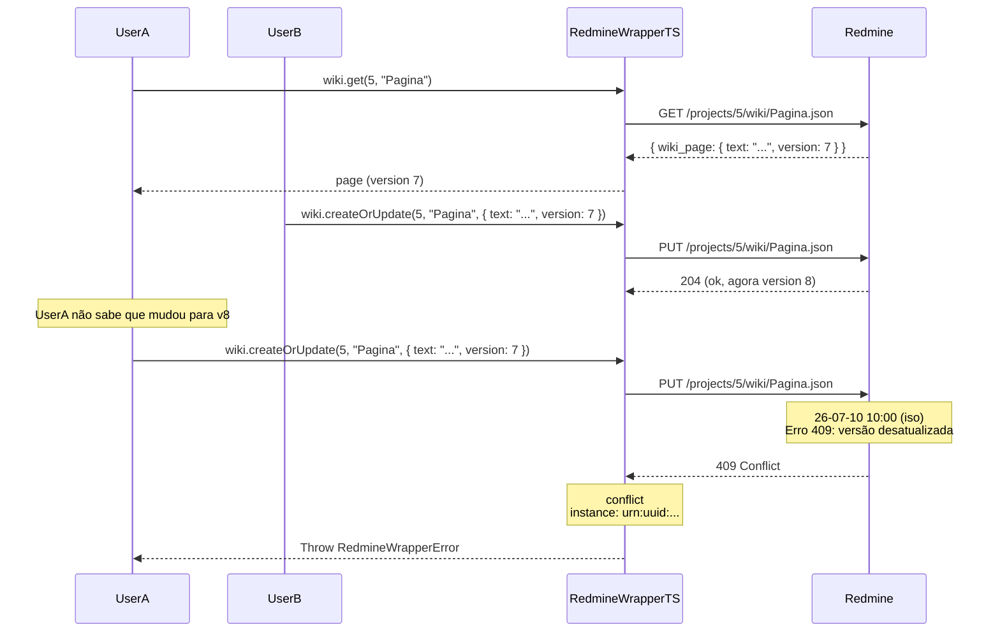

# Erro: `conflict` (409 Conflict)



O erro `conflict` ocorre tipicamente ao atualizar uma página wiki cuja versão foi incrementada por outra edição desde a última leitura. O Redmine usa controle de concorrência otimista (optimistic locking) para prevenir sobrescrita acidental.

## 🛠️ Como ocorre

1. **Concorrência em Wiki:** Dois usuários leem a mesma página wiki, um deles salva primeiro, e o segundo tenta salvar com a versão antiga.
2. **Versionamento Esquecido:** O campo `version` não foi incluído no payload de atualização da wiki (o Redmine aceita, mas não protege contra conflitos).
3. **Race Condition:** Processos automatizados que leem e atualizam a wiki concorrentemente.

## 💻 Exemplos de Código

### Exemplo 1: Conflito Clássico de Wiki

```typescript
const sdk = RedmineWrapperTS.create({ baseUrl, apiKey });

// Leitura inicial
const page = await sdk.wiki.get(5, "GuiaDeUso");
// page.version = 7

// Outro processo salva com version 7 → OK
await sdk.wiki.createOrUpdate(5, "GuiaDeUso", {
    text: "Conteúdo atualizado",
    version: 7,
    comments: "Revisão 1",
});

// Tentativa de salvar novamente com a mesma versão → 409
try {
    await sdk.wiki.createOrUpdate(5, "GuiaDeUso", {
        text: "Outra atualização",
        version: 7,  // Agora a versão atual é 8!
        comments: "Revisão 2",
    });
} catch (err) {
    if (err instanceof RedmineWrapperError && err.status === 409) {
        console.error(`[${err.instance}] Conflito de versão!`);
        // Re-ler a página e tentar novamente com a versão atual
    }
}
```

### Exemplo 2: Resolução com Retry

```typescript
async function updateWikiWithRetry(
    projectId: number,
    title: string,
    updateFn: (current: WikiPage) => CreateWikiPagePayload,
    maxRetries = 3,
): Promise<void> {
    for (let attempt = 0; attempt < maxRetries; attempt++) {
        // Re-ler sempre a versão mais recente
        const current = await sdk.wiki.get(projectId, title);
        const payload = updateFn(current);

        try {
            await sdk.wiki.createOrUpdate(projectId, title, {
                ...payload,
                version: current.version,
            });
            return; // Sucesso
        } catch (err) {
            if (err instanceof RedmineWrapperError && err.status !== 409) {
                throw err;  // Erro diferente de conflito
            }
            // Conflito: tentar novamente (re-ler)
            if (attempt === maxRetries - 1) throw err;
        }
    }
}
```

## ✅ O que fazer

- **Sempre incluir `version`:** Ao atualizar wiki, inclua o campo `version` com o número obtido na leitura.
- **Implementar retry com re-leitura:** Em caso de 409, leia a página novamente para obter a versão atual e tente aplicar a mudança.
- **Usar merge manual:** Se o conflito for entre duas edições legítimas, faça o merge manual do conteúdo antes de salvar.
- **Evitar concorrência:** Para edições automatizadas, considere usar um mecanismo de fila ou lock externo.

## 🧠 Reflexão Técnica: Por que o Redmine usa optimistic locking?

O Redmine adota **controle de concorrência otimista** (optimistic locking) para a wiki porque:

1. **Simplicidade:** Não requer locks no banco de dados, que adicionariam latência e complexidade.
2. **Baixa contenção:** Conflitos simultâneos na mesma página wiki são relativamente raros.
3. **Prevenção de perda de dados:** Sem o version guard, a última edição sobrescreveria a anterior silenciosamente — a versão mais recente seria perdida sem nenhum aviso.

O custo é que o cliente precisa lidar com o 409 e re-tentar, mas isso é preferível a perder edições de usuários silenciosamente.

---

## 🔗 Veja também

- [**Guia de Erros**](./errors.md): Lista completa de exceções.
- [**Particularidades da API**](../particularities.md): Wiki version guard detalhado.
- [**Guia de Uso**](../usage-guide.md): Wiki — exemplos completos.

---

[↑ Voltar ao índice](./errors.md)
