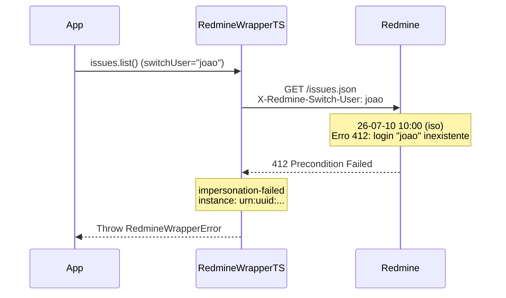

# Erro: `impersonation-failed` (412 Precondition Failed)



O erro `impersonation-failed` ocorre ao usar o header `X-Redmine-Switch-User` (via `switchUser` na configuração) com um login inválido ou quando a conta autenticada não tem privilégios de administrador.

## 🛠️ Como ocorre

1. **Login Inexistente:** O login especificado em `switchUser` não corresponde a nenhum usuário ativo no Redmine.
2. **Usuário Inativo:** O usuário alvo existe mas está com status "locked" ou "registered" (não ativo).
3. **Sem Privilégios de Admin:** A conta cuja API key está sendo usada não é administradora. A impersonação requer privilégios de admin.
4. **Mudança de Login:** O login do usuário alvo foi alterado após a configuração.

## 💻 Exemplos de Código

### Exemplo 1: Login Inexistente

```typescript
const sdk = RedmineWrapperTS.create({
    baseUrl: "https://redmine.example.com",
    apiKey: adminApiKey,
    switchUser: "usuario-inexistente",
});

try {
    await sdk.issues.list({ assigned_to_id: "me" });
} catch (err) {
    if (err instanceof RedmineWrapperError && err.status === 412) {
        console.error(`[${err.instance}] Impersonação falhou: ${err.detail}`);
    }
}
```

### Exemplo 2: Usuário Não-Admin Tentando Impersonar

```ts
// Esta API key é de um usuário COMUM, não admin
const sdk = RedmineWrapperTS.create({
    baseUrl: "https://redmine.example.com",
    apiKey: userApiKey,
    switchUser: "joao",  // Ignorado pelo Redmine
});

// O header X-Redmine-Switch-User é ignorado pelo servidor
// A requisição é feita como o próprio usuário da API key
```

### Exemplo 3: Verificação de Admin Antes de Impersonar

```typescript
const sdk = RedmineWrapperTS.create({
    baseUrl: "https://redmine.example.com",
    apiKey: candidateApiKey,
});

// Verificar se é admin
const me = await sdk.myAccount.get();

if (me.admin) {
    // Só criar instância com impersonação se for admin
    const sdkImp = RedmineWrapperTS.create({
        baseUrl: "https://redmine.example.com",
        apiKey: candidateApiKey,
        switchUser: "joao",
    });
    await sdkImp.issues.list({ assigned_to_id: "me" });
} else {
    console.error("Conta não é administradora — impersonação não disponível");
}
```

## ✅ O que fazer

- **Verificar o login:** Confirme que o login do usuário alvo está correto e ativo no Redmine.
- **Confirmar privilégios:** A API key usada deve pertencer a um administrador.
- **Testar com curl:**
  ```bash
  curl -H "X-Redmine-API-Key: admin-key" \
    -H "X-Redmine-Switch-User: joao" \
    https://redmine.example.com/my/account.json
  ```
- **Usar login, não email:** O `X-Redmine-Switch-User` espera o **login** do usuário, não o email ou nome completo.

## 🧠 Reflexão Técnica: Por que a impersonação é restrita a admins?

A impersonação é uma ferramenta poderosa que permite que um administrador "aja como" outro usuário. Isso é útil para:

- **Debugging:** Reproduzir problemas relatados por um usuário específico.
- **Automação:** Executar ações em nome de vários usuários sem exigir suas credenciais.
- **Suporte:** Realizar alterações que o usuário não tem permissão para fazer.

Restringir isso a administradores é uma medida de segurança essencial: se qualquer usuário pudesse impersonar qualquer outro, não haveria controle de acesso efetivo. O UUIDv7 no erro permite rastrear exatamente qual administrador (ou tentativa de) realizou a impersonação.

---

## 🔗 Veja também

- [**Guia de Erros**](./errors.md): Lista completa de exceções.
- [**Particularidades da API**](../particularities.md): Impersonação — detalhes e limitações.
- [**Getting Started**](../getting-started.md): Configuração de switchUser.

---

[↑ Voltar ao índice](./errors.md)
