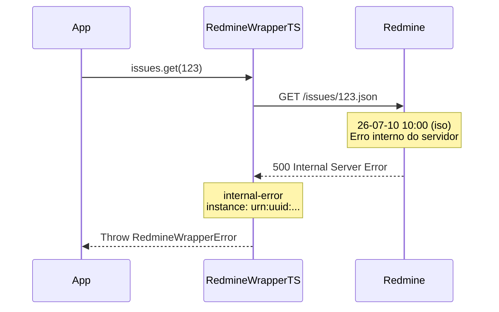

# Erro: `internal-error` (500 Internal Server Error)



O erro `internal-error` é o fallback para situações não categorizadas — geralmente status HTTP que não estão no mapeamento de erros do SDK, ou respostas sem mensagens de erro legíveis.

## 🛠️ Como ocorre

1. **Status HTTP Não Mapeado:** O servidor retornou um status que não está no mapa interno do SDK (ex: 502, 503 sem mensagem específica).
2. **Erro Interno do Redmine:** O servidor Redmine encontrou uma exceção não tratada.
3. **Resposta Vazia:** O servidor retornou um status de erro sem corpo (sem mensagens de erro).
4. **Manutenção do Servidor:** O servidor pode estar em manutenção e retornando páginas genéricas.

## 💻 Exemplos de Código

### Exemplo 1: Erro Genérico do Servidor

```typescript
const sdk = RedmineWrapperTS.create({ baseUrl, apiKey });

try {
    const issue = await sdk.issues.get(123);
} catch (err) {
    if (err instanceof RedmineWrapperError) {
        console.error(`[${err.instance}] Tipo: ${err.title}`);
        console.error(`Status: ${err.status}`);
        console.error(`Detalhe: ${err.detail}`);

        if (err.title === "internal-error") {
            // Status não mapeado — inspecionar contexto
            console.error(err.context);
        }
    }
}
```

### Exemplo 2: Diagnosticando o Contexto

```typescript
try {
    await sdk.issues.list({ status_id: "*" }).toArray();
} catch (err) {
    if (err instanceof RedmineWrapperError && err.title === "internal-error") {
        // O context pode conter a resposta bruta
        const ctx = err.context;
        console.log(`Operação: ${ctx.operation}`);
        console.log(`HTTP Status: ${ctx.httpStatus}`);

        // Se houver responseBody, pode conter detalhes do erro do servidor
        if (ctx.responseBody) {
            console.log("Resposta do servidor:", ctx.responseBody);
        }
    }
}
```

## ✅ O que fazer

- **Verificar o status HTTP real no `context.httpStatus`:** O campo `err.context.httpStatus` contém o código de status retornado pelo servidor.
- **Inspecionar a resposta:** O `err.context.responseBody` pode conter a resposta bruta do servidor com detalhes do erro.
- **Reportar o status:** Se você encontrar um status HTTP não mapeado (ex: 502, 503), reporte como issue no repositório do SDK para que ele seja adicionado ao mapa de erros.
- **Verificar o servidor:** O problema pode ser no servidor Redmine, não no SDK. Verifique os logs do servidor.
- **Contatar o administrador:** Se o erro for persistente, o administrador do Redmine pode identificar a causa nos logs do servidor.

### Mapa de Status Atuais

O SDK atualmente mapeia os seguintes status HTTP:

| Status | Categoria |
|--------|-----------|
| 401 | `authentication-failed` |
| 403 | `authorization-denied` |
| 404 | `resource-not-found` |
| 409 | `conflict` |
| 412 | `impersonation-failed` |
| 413 | `upload-too-large` |
| 422 | `validation-error` |
| 429 | `rate-limited` |

Qualquer status fora dessa lista (ex: 500, 502, 503, 504 sem timeout) resulta em `internal-error`.

## 🧠 Reflexão Técnica: Por que ter um fallback genérico?

O `internal-error` serve como uma **rede de segurança** para situações imprevistas. A API do Redmine pode evoluir e introduzir novos códigos de status, ou o servidor pode retornar erros inesperados.

Em vez de quebrar silenciosamente ou lançar uma exceção sem sentido, o SDK captura qualquer status HTTP não mapeado e o envolve em um `RedmineWrapperError` com categoria `internal-error`, preservando:

- O status HTTP original (via `context.httpStatus`)
- A resposta do servidor (via `context.responseBody`)
- Um UUIDv7 único para rastreamento

Isso garante que **nenhuma falha passe despercebida**. Mesmo que o SDK não saiba como classificar o erro, ele ainda fornece contexto suficiente para diagnóstico.

---

## 🔗 Veja também

- [**Guia de Erros**](./errors.md): Lista completa de exceções.
- [**Guia de Integração**](../integration-guide.md): Monitoramento e alertas.
- [**Particularidades da API**](../particularities.md): Comportamentos específicos da API.

---

[↑ Voltar ao índice](./errors.md)
