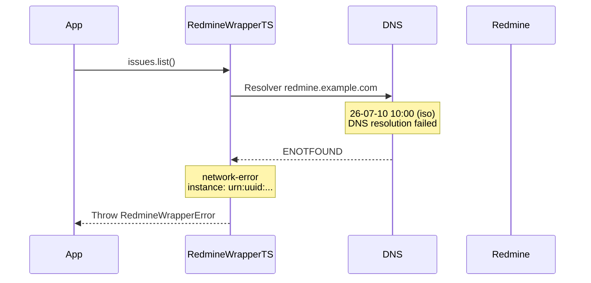

# Erro: `network-error` (503 Service Unavailable)



O erro `network-error` ocorre quando a requisição HTTP não consegue ser completada devido a problemas de conectividade entre o cliente e o servidor Redmine.

## 🛠️ Como ocorre

1. **Servidor Offline:** O servidor Redmine está fora do ar (manutenção, falha de hardware).
2. **DNS Irresolvível:** O nome do domínio não pode ser resolvido para um endereço IP.
3. **Firewall Bloqueando:** Um firewall ou proxy está bloqueando a conexão com o servidor Redmine.
4. **Certificado SSL Inválido:** O certificado TLS do servidor expirou ou é inválido.
5. **Rede Indisponível:** O cliente não tem acesso à internet ou à rede interna.

## 💻 Exemplos de Código

### Exemplo 1: URL Incorreta

```typescript
const sdk = RedmineWrapperTS.create({
    baseUrl: "https://redmine-nao-existe.com",  // Domínio que não existe
    apiKey: "chave",
});

try {
    await sdk.myAccount.get();
} catch (err) {
    if (err instanceof RedmineWrapperError && err.title === "network-error") {
        console.error(`[${err.instance}] Falha de rede: ${err.detail}`);
        // → "error: getaddrinfo ENOTFOUND redmine-nao-existe.com"
    }
}
```

### Exemplo 2: Protocolo Incorreto

```typescript
const sdk = RedmineWrapperTS.create({
    baseUrl: "http://redmine.example.com",  // HTTP em vez de HTTPS
    apiKey: "chave",
});

// Se o servidor redirecionar para HTTPS, pode funcionar
// Se o servidor rejeitar HTTP, lança network-error
```

### Exemplo 3: Proxy Corporativo

```typescript
// Se você estiver atrás de um proxy corporativo, o Deno precisa
// ser configurado com as variáveis de ambiente HTTP_PROXY

// export HTTP_PROXY="http://proxy.company.com:8080"
// export HTTPS_PROXY="http://proxy.company.com:8080"

const sdk = RedmineWrapperTS.create({
    baseUrl: "https://redmine.example.com",
    apiKey: "chave",
});
```

## ✅ O que fazer

- **Verificar a URL:** Confirme se a `baseUrl` está correta e acessível.
- **Testar com curl/ browser:** Isole o problema testando o acesso direto ao Redmine.
- **Verificar DNS:** `nslookup redmine.example.com` ou `dig redmine.example.com`.
- **Verificar firewall:** Confirme se a porta 443 (HTTPS) está liberada para o servidor.
- **Verificar certificado:** `openssl s_client -connect redmine.example.com:443`.
- **Implementar health check:** Antes de operações críticas, verifique se o servidor está acessível.

### Testes de Conectividade

```bash
# Testar DNS
nslookup redmine.example.com

# Testar conectividade
curl -I --connect-timeout 5 https://redmine.example.com

# Testar certificado SSL
openssl s_client -connect redmine.example.com:443 -servername redmine.example.com
```

## 🧠 Reflexão Técnica: Por que network-error e timeout são erros diferentes?

A distinção entre `network-error` (503) e `timeout` (504) é fundamental para a estratégia de tratamento:

- **Network Error:** A requisição nunca chegou ao servidor. Não adianta retentar no mesmo momento — o problema é estrutural (DNS, firewall, certificado). Ação recomendada: alertar a equipe de infraestrutura.
- **Timeout:** A requisição chegou ao servidor, mas ele não respondeu a tempo. Pode ser congestionamento temporário. Ação recomendada: retentar com backoff.

Confundir os dois levaria a estratégias de retry ineficazes: retentar um network error só consumiria recursos sem resolver o problema, enquanto desistir de um timeout sem retry poderia perder uma operação que teria sucesso na segunda tentativa.

---

## 🔗 Veja também

- [**Guia de Erros**](./errors.md): Lista completa de exceções.
- [**Guia de Integração**](../integration-guide.md): Health check e resiliência.
- [**Particularidades da API**](../particularities.md): Configuração de rede.

---

[↑ Voltar ao índice](./errors.md)
