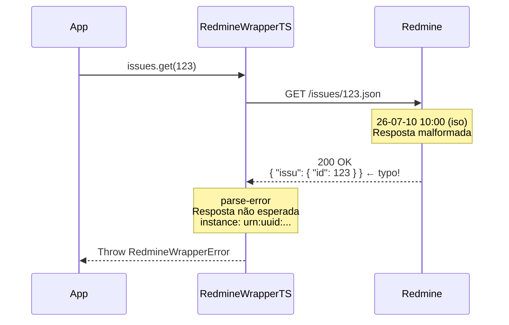

# Erro: `parse-error` (500 Internal Server Error)



O erro `parse-error` ocorre quando a resposta do servidor Redmine não pode ser interpretada corretamente pelo SDK. Isso geralmente indica uma mudança na estrutura da API, um bug no servidor, ou uma resposta inesperada.

## 🛠️ Como ocorre

1. **Mudança na API:** Uma atualização do Redmine alterou a estrutura da resposta (ex: nova versão com campos diferentes).
2. **Resposta Malformada:** O servidor retornou JSON inválido ou vazio em vez da estrutura esperada.
3. **Proxy Manipulando Resposta:** Um proxy ou gateway entre o cliente e o servidor modificou o corpo da resposta.
4. **Erro Interno do Servidor:** O Redmine retornou 200 OK mas o corpo contém uma página de erro HTML em vez de JSON.

## 💻 Exemplos de Código

### Exemplo 1: Resposta Inesperada

```typescript
const sdk = RedmineWrapperTS.create({ baseUrl, apiKey });

try {
    const issue = await sdk.issues.get(123);
} catch (err) {
    if (err instanceof RedmineWrapperError && err.title === "parse-error") {
        console.error(`[${err.instance}] Resposta inesperada do servidor`);
        console.error(err.context.responseBody);  // Inspecionar resposta bruta
    }
}
```

### Exemplo 2: Versão Incompatível

```typescript
// Se o servidor Redmine for muito antigo ou muito novo, a estrutura
// da resposta pode não corresponder ao que o SDK espera.

// Verificar a versão do Redmine (se disponível via API ou administrativamente)
// Endpoints de health check podem ajudar a diagnosticar
```

## ✅ O que fazer

- **Verificar a versão do Redmine:** O SDK foi testado com Redmine 1.0 a 5.x. Versões muito antigas ou futuras podem ter estruturas diferentes.
- **Inspecionar `context.responseBody`:** O campo `err.context.responseBody` contém a resposta bruta que o servidor retornou.
- **Atualizar o SDK:** Verifique se há uma versão mais recente do `@st-all-one/redmine-wrapper-ts` que suporte a versão do seu Redmine.
- **Reportar o problema:** Se a estrutura da resposta parece incorreta para o seu Redmine, abra uma issue no repositório do SDK com o `responseBody` (sanitizado).
- **Testar com curl diretamente:**
  ```bash
  curl -H "X-Redmine-API-Key: chave" \
    https://redmine.example.com/issues/123.json
  ```

## 🧠 Reflexão Técnica: Por que o parse-error é uma categoria separada?

Diferente de `internal-error` (que é um catch-all para status HTTP não mapeados), o `parse-error` indica que a requisição foi bem-sucedida do ponto de vista HTTP (status 2xx), mas o **formato da resposta** não corresponde ao esperado.

Isso é importante porque:

1. **HTTP OK não significa dados OK:** Um `200 OK` com corpo inesperado não é um erro de rede nem de autenticação — é um erro de contrato de API.
2. **Diagnóstico rápido:** Ao ver `parse-error`, o desenvolvedor sabe imediatamente que o problema está na compatibilidade entre o SDK e a versão do Redmine, não na configuração ou na rede.
3. **Prevenção de falsos negativos:** Sem essa distinção, uma resposta inesperada poderia ser interpretada como sucesso (porque o HTTP status é 200), resultando em dados corrompidos sendo processados silenciosamente.

O erro `parse-error` é um **mecanismo de segurança** contra mudanças silenciosas na API.

---

## 🔗 Veja também

- [**Guia de Erros**](./errors.md): Lista completa de exceções.
- [**Guia de Integração**](../integration-guide.md): Monitoramento de falhas.
- [**Particularidades da API**](../particularities.md): Versões compatíveis do Redmine.

---

[↑ Voltar ao índice](./errors.md)
