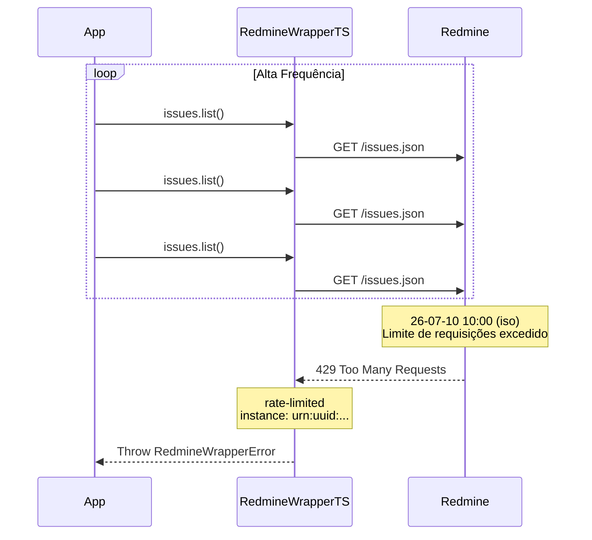

# Erro: `rate-limited` (429 Too Many Requests)



O erro `rate-limited` ocorre quando o servidor Redmine recebe mais requisições do que o permitido em um determinado período de tempo.

## 🛠️ Como ocorre

1. **Múltiplas Instâncias:** Várias instâncias do SDK compartilhando a mesma API key podem exceder o limite combinado.
2. **Loops Sem Pausa:** Processos de polling ou sincronização que não respeitam intervalos entre requisições.
3. **Servidor Configurado:** O administrador do Redmine configurou um limite de requisições (via plugin ou configuração de servidor web).
4. **Rate Limiter Interno Ultrapassado:** O limite interno do SDK (default 10 req/s) pode ser maior que o limite do servidor.

## 💻 Exemplos de Código

### Exemplo 1: Rate Limiting no Cliente

```typescript
const sdk = RedmineWrapperTS.create({
    baseUrl: "https://redmine.example.com",
    apiKey: "chave",
    maxRps: 2,  // Reduzir para 2 requisições por segundo
});

// O SDK já limita internamente, mas o servidor pode ser mais restritivo
```

### Exemplo 2: Retry com Backoff Exponencial

```typescript
import { RedmineWrapperError } from "@st-all-one/redmine-wrapper-ts";

async function withRateLimitRetry<T>(
    fn: () => Promise<T>,
    maxRetries = 5,
): Promise<T> {
    for (let attempt = 0; attempt < maxRetries; attempt++) {
        try {
            return await fn();
        } catch (err) {
            if (err instanceof RedmineWrapperError && err.status === 429) {
                const waitMs = Math.min(
                    Math.pow(2, attempt) * 1000,
                    30_000,  // Máximo de 30s
                );
                console.warn(
                    `[${err.instance}] Rate limited. Tentativa ${attempt + 1}.`
                    + ` Aguardando ${waitMs}ms...`,
                );
                await new Promise(r => setTimeout(r, waitMs));
                continue;
            }
            throw err;
        }
    }
    throw new Error(`Falha após ${maxRetries} tentativas (rate limited)`);
}

// Uso com retry
const issues = await withRateLimitRetry(() =>
    sdk.issues.list({ status_id: "open" }).toArray()
);
```

### Exemplo 3: Múltiplas Instâncias Consumindo a Mesma API Key

```typescript
// Cenário: 3 microsserviços compartilham a mesma API key
// Cada um com seu próprio rate limiter (10 req/s cada)
// Total combinado: 30 req/s — pode exceder o limite do servidor

// Solução: coordenar via um proxy com rate limiting global
// Ou reduzir maxRps em cada instância
const sdk = RedmineWrapperTS.create({
    baseUrl,
    apiKey,
    maxRps: 3,  // 3 instâncias x 3 req/s = 9 req/s (seguro)
});
```

## ✅ O que fazer

- **Reduzir `maxRps`:** Configure um valor menor no SDK para respeitar os limites do servidor.
- **Implementar backoff exponencial:** Para polling, aumente o intervalo entre tentativas após cada falha.
- **Distribuir requisições:** Evite picos sincronizados de requisições (ex: muitos CRONs no mesmo minuto).
- **Cachear respostas:** Dados que mudam com pouca frequência (statuses, trackers, enumerations) podem ser cacheados por horas.
- **Usar fila:** Para operações em lote, processe as requisições sequencialmente ou com um intervalo entre elas.

## 🧠 Reflexão Técnica: Por que o rate limiter é importante e como ele funciona?

O rate limiter interno do SDK (configurável via `maxRps`, default 10 req/s) protege tanto o servidor Redmine quanto a própria aplicação:

1. **Proteção ao Servidor:** Evita que bugs (loops infinitos) ou picos de tráfego derrubem o Redmine.
2. **Justiça entre Clientes:** Distribui a largura de banda igualmente entre as requisições.
3. **Previsibilidade:** Torna o comportamento da integração determinístico e testável.

O limite de **10 requisições por segundo** é um valor conservador e seguro para a maioria dos servidores Redmine. Se você precisa de maior throughput, aumente gradualmente e monitore a ocorrência de erros 429.

---

## 🔗 Veja também

- [**Guia de Erros**](./errors.md): Lista completa de exceções.
- [**Guia de Integração**](../integration-guide.md): Padrões de retry e resiliência.
- [**Particularidades da API**](../particularities.md): Performance e boas práticas.

---

[↑ Voltar ao índice](./errors.md)
