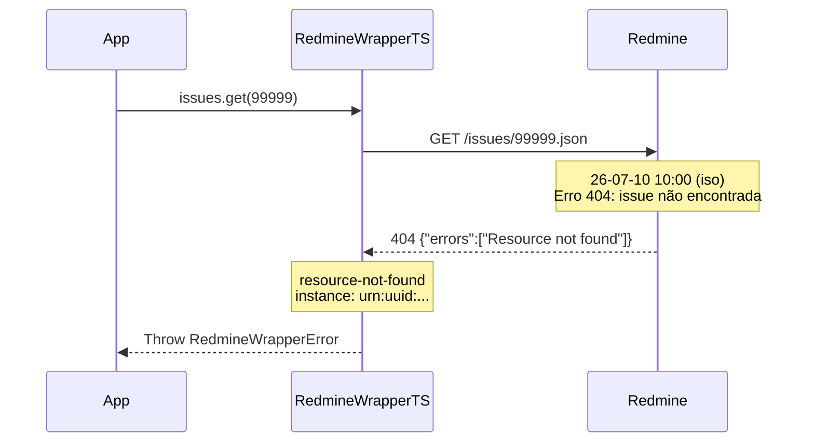

# Erro: `resource-not-found` (404 Not Found)



O erro `resource-not-found` ocorre quando o recurso solicitado não existe no servidor Redmine, seja porque o ID está incorreto, o recurso foi deletado, ou o usuário não tem acesso a ele.

## 🛠️ Como ocorre

1. **ID Incorreto:** O ID do recurso passado na requisição não corresponde a nenhum registro existente.
2. **Recurso Deletado:** O recurso existia mas foi removido entre a listagem e a busca individual.
3. **Usuário sem Acesso:** O recurso existe, mas o usuário autenticado não tem permissão para vê-lo (projeto privado). O Redmine retorna 404 em vez de 403 para não revelar a existência de recursos protegidos.
4. **URL Incorreta:** A URL base do Redmine está configurada errada, resultando em caminhos inválidos.

## 💻 Exemplos de Código

### Exemplo 1: Issue com ID Inexistente

```typescript
const sdk = RedmineWrapperTS.create({ baseUrl, apiKey });

try {
    const issue = await sdk.issues.get(99999);
} catch (err) {
    if (err instanceof RedmineWrapperError && err.status === 404) {
        console.error(`[${err.instance}] Issue não encontrada: ${err.detail}`);
        // Recurso não encontrado
    }
}
```

### Exemplo 2: Corrida (Race Condition) Entre Listagem e Deleção

```typescript
// Lista as issues abertas
const issues = await sdk.issues.list({ status_id: "open" }).toArray();

// Outro processo deleta a issue #42 aqui...

// Tenta buscar uma issue que já foi deletada
for (const issue of issues) {
    try {
        const full = await sdk.issues.getWithIncludes(issue.id, ["journals"]);
    } catch (err) {
        if (err instanceof RedmineWrapperError && err.status === 404) {
            console.warn(`Issue #${issue.id} foi deletada entre a listagem e a leitura`);
            continue;  // Pula a issue que não existe mais
        }
    }
}
```

### Exemplo 3: Projeto Privado sem Acesso

```typescript
const sdk = RedmineWrapperTS.create({ baseUrl, apiKey: userKey });

try {
    const project = await sdk.projects.get(42);
} catch (err) {
    if (err instanceof RedmineWrapperError && err.status === 404) {
        // Pode ser que o projeto não exista OU seja privado
        console.error("Projeto inacessível ou inexistente");
    }
}
```

## ✅ O que fazer

- **Verificar o ID:** Confirme se o ID do recurso está correto. IDs mudam entre ambientes.
- **Confirmar acesso:** Se o recurso existe mas você não tem acesso, solicite ao administrador.
- **Tratar como esperado:** Em operações em lote, resources podem ser deletados entre requisições — trate 404 como um "item não disponível" e continue o processamento.
- **Testar com curl:**
  ```bash
  curl -H "X-Redmine-API-Key: chave" \
    https://redmine.example.com/issues/99999.json
  ```

## 🧠 Reflexão Técnica: Por que o Redmine retorna 404 para recursos sem acesso?

Por uma questão de **segurança por obscuridade**, o Redmine retorna 404 (não encontrado) em vez de 403 (proibido) quando um usuário tenta acessar um recurso de um projeto privado ao qual não tem acesso. Isso evita que usuários não autorizados descubram a existência de projetos, issues ou recursos que não deveriam conhecer.

Isso significa que um `resource-not-found` pode ter duas causas: o recurso realmente não existe, ou o recurso existe mas é inacessível. Para distinguir, use uma conta com acesso administrativo para verificar.

---

## 🔗 Veja também

- [**Guia de Erros**](./errors.md): Lista completa de exceções.
- [**Particularidades da API**](../particularities.md): Mais sobre segurança e permissões.

---

[↑ Voltar ao índice](./errors.md)
