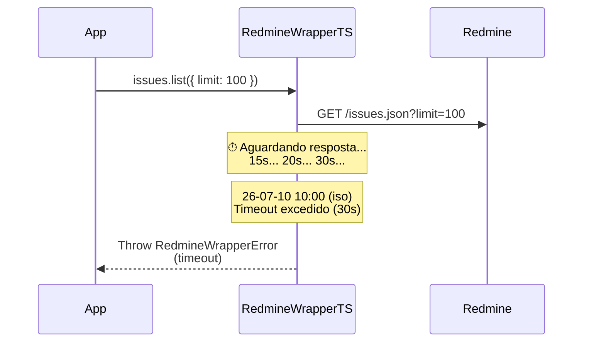

# Erro: `timeout` (504 Gateway Timeout)



O erro `timeout` ocorre quando o servidor Redmine não responde dentro do tempo limite configurado na instância do SDK.

## 🛠️ Como ocorre

1. **Servidor Lento:** O Redmine está sob carga elevada e demora a processar a requisição.
2. **Timeout Muito Baixo:** O valor de `timeoutMs` configurado é insuficiente para operações complexas.
3. **Rede Lenta:** Latência alta entre o cliente e o servidor Redmine.
4. **Requisição Bloqueante:** Operações que exigem processamento pesado no servidor (relatórios, exportações).

## 💻 Exemplos de Código

### Exemplo 1: Timeout Baixo Demais

```typescript
const sdk = RedmineWrapperTS.create({
    baseUrl: "https://redmine.lento.com",
    apiKey: "chave",
    timeoutMs: 1_000,  // Apenas 1 segundo!
});

try {
    await sdk.issues.list({ status_id: "*" }).toArray();
} catch (err) {
    if (err instanceof RedmineWrapperError && err.title === "timeout") {
        console.error(`[${err.instance}] Timeout: servidor não respondeu em 1s`);
    }
}
```

### Exemplo 2: Aumentando o Timeout

```typescript
// Para operações batch, aumente o timeout
const sdk = RedmineWrapperTS.create({
    baseUrl: "https://redmine.example.com",
    apiKey: "chave",
    timeoutMs: 120_000,  // 2 minutos para operações pesadas
});

// Para operações rápidas, crie uma instância separada
const sdkRapido = RedmineWrapperTS.create({
    baseUrl: "https://redmine.example.com",
    apiKey: "chave",
    timeoutMs: 5_000,  // 5 segundos para GETs simples
});
```

### Exemplo 3: Retry com Backoff

```typescript
import { RedmineWrapperError } from "@st-all-one/redmine-wrapper-ts";

async function withTimeoutRetry<T>(
    fn: () => Promise<T>,
    maxRetries = 2,
): Promise<T> {
    for (let attempt = 0; attempt < maxRetries; attempt++) {
        try {
            return await fn();
        } catch (err) {
            if (err instanceof RedmineWrapperError && err.title === "timeout") {
                const wait = (attempt + 1) * 2000;
                console.warn(
                    `[${err.instance}] Timeout na tentativa ${attempt + 1}.`
                    + ` Aguardando ${wait}ms...`,
                );
                await new Promise(r => setTimeout(r, wait));
                continue;
            }
            throw err;
        }
    }
    throw new Error(`Timeout persistente após ${maxRetries} tentativas`);
}
```

## ✅ O que fazer

- **Aumentar o timeout:** Se a operação é legítima mas lenta, aumente `timeoutMs` (default 30s, pode ir até 120s+).
- **Verificar a rede:** Teste a latência até o servidor com `ping` ou `curl -w "%{time_total}"`.
- **Otimizar a consulta:** Use filtros mais específicos para reduzir a carga no servidor.
- **Implementar retry:** Timeouts podem ser transitórios — uma segunda tentativa pode funcionar.
- **Separar timeouts:** Use instâncias diferentes para operações rápidas (GET individuais) e lentas (listagens grandes, uploads).

## 🧠 Reflexão Técnica: Timeout vs Network Error

Timeout (504) e Network Error (503) são diferentes:

- **Timeout (504):** A requisição chegou ao servidor, mas ele não respondeu a tempo. O problema é latência ou processamento lento.
- **Network Error (503):** A requisição nem chegou ao servidor — falha de DNS, conexão recusada, certificado SSL inválido.

Um timeout pode ser resolvido com retry (o servidor pode estar momentaneamente sobrecarregado). Um network error geralmente indica um problema de configuração ou infraestrutura que precisa de intervenção manual.

---

## 🔗 Veja também

- [**Guia de Erros**](./errors.md): Lista completa de exceções.
- [**Guia de Integração**](../integration-guide.md): Retry com backoff.
- [**Getting Started**](../getting-started.md): Configuração de timeout.

---

[↑ Voltar ao índice](./errors.md)
