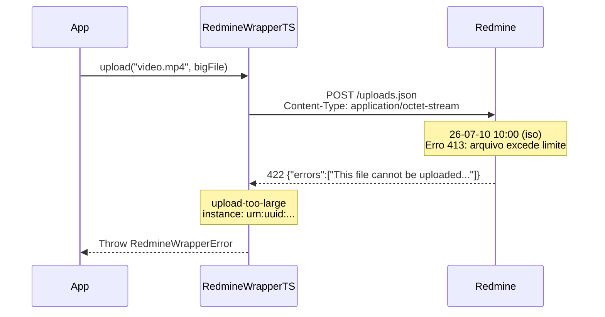

# Erro: `upload-too-large` (413 Payload Too Large)



O erro `upload-too-large` ocorre quando o arquivo enviado excede o limite máximo de tamanho configurado no servidor Redmine. O limite é definido administrativamente em *Administration → Settings → Attachment size*.

## 🛠️ Como ocorre

1. **Arquivo Acima do Limite:** O arquivo excede o tamanho máximo permitido (default geralmente 10MB ou 100MB).
2. **Configuração Restritiva:** O servidor foi configurado com um limite baixo para economizar espaço em disco.
3. **Upload Múltiplo:** A soma dos uploads pode ser limitada, mesmo que cada arquivo individual esteja abaixo do limite.

## 💻 Exemplos de Código

### Exemplo 1: Arquivo Muito Grande (2-Step Upload)

```typescript
const sdk = RedmineWrapperTS.create({ baseUrl, apiKey });

const bigFile = await Deno.readFile("relatorio-completo-4k-video.mp4");

try {
    const token = await sdk.attachments.upload("video.mp4", bigFile);
} catch (err) {
    if (err instanceof RedmineWrapperError && err.status === 413) {
        console.error(`[${err.instance}] Upload excede limite:`);
        console.error(err.detail);
        // → "This file cannot be uploaded because it exceeds
        //    the maximum allowed file size (1024000)"
    }
}
```

### Exemplo 2: Verificação Preventiva (Simulada)

```typescript
// O Redmine não expõe o limite por API, mas você pode
// tentar um upload de 1 byte e ler o erro para descobrir
async function getMaxUploadSize(): Promise<number | null> {
    try {
        await sdk.attachments.upload("test.tmp", new Uint8Array(1));
        return null;  // Limite desconhecido, mas 1 byte funciona
    } catch (err) {
        if (err instanceof RedmineWrapperError && err.status === 413) {
            const match = err.detail.match(/\((\d+)\)/);
            return match ? parseInt(match[1]!, 10) : null;
        }
        return null;
    }
}
```

### Exemplo 3: Compressão Antes do Upload

```typescript
// Se o arquivo for muito grande, considere comprimir
async function uploadWithCompression(
    filename: string,
    data: Uint8Array,
): Promise<string> {
    try {
        return await sdk.attachments.upload(filename, data);
    } catch (err) {
        if (err instanceof RedmineWrapperError && err.status === 413) {
            // Comprimir e tentar novamente
            const compressed = await compressData(data);
            return await sdk.attachments.upload(
                filename.replace(/\.[^.]+$/, "") + ".zip",
                compressed,
            );
        }
        throw err;
    }
}
```

## ✅ O que fazer

- **Verificar o limite:** Consulte o administrador do Redmine para saber o limite configurado.
- **Comprimir o arquivo:** Antes de enviar, comprima arquivos grandes (zip, tar.gz).
- **Dividir o arquivo:** Se possível, divida em partes menores e faça uploads separados.
- **Aumentar o limite:** Solicite ao administrador que aumente o limite em *Administration → Settings → Attachment size*.
- **Validar no cliente:** Antes de enviar, verifique o tamanho do arquivo e avise o usuário.

## 🧠 Reflexão Técnica: Por que o upload tem 2 passos?

O processo de upload do Redmine é dividido em duas etapas por uma razão arquitetural importante:

1. **Step 1 (POST /uploads.json):** O conteúdo binário é enviado ao servidor, que armazena em uma área temporária e retorna um token. Isso permite que o arquivo seja processado (verificação de vírus, análise de tamanho) antes de ser associado a qualquer recurso.

2. **Step 2 (Incluir token no recurso):** O token é incluído no payload de criação/atualização da issue, wiki ou notícia. O servidor então move o arquivo da área temporária para o recurso definitivo.

Essa separação permite que um arquivo seja carregado uma vez e associado a múltiplos recursos, ou que o upload seja feito em um momento e a associação em outro (útil para formulários longos onde o usuário pode perder a sessão).

---

## 🔗 Veja também

- [**Guia de Erros**](./errors.md): Lista completa de exceções.
- [**Guia de Uso**](../usage-guide.md): Upload 2-step — exemplos completos.
- [**Particularidades da API**](../particularities.md): Limitações de upload.

---

[↑ Voltar ao índice](./errors.md)
