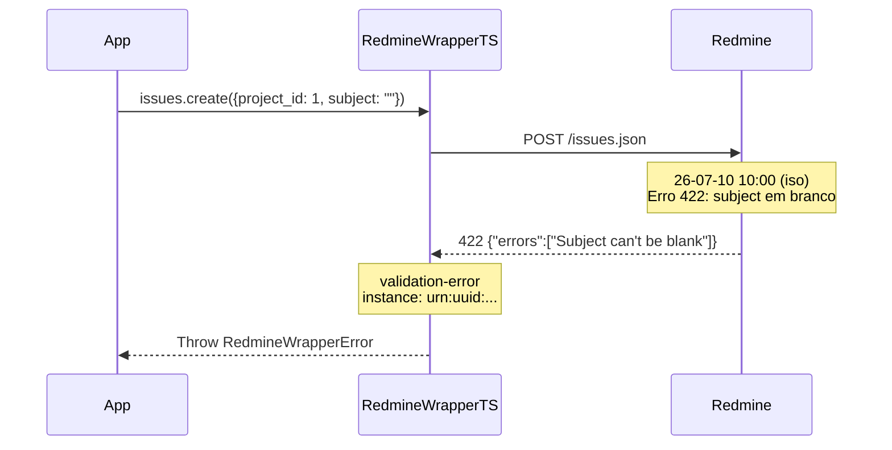

# Erro: `validation-error` (422 Unprocessable Entity)



O erro `validation-error` ocorre quando a requisição contém dados inválidos segundo as regras de validação do Redmine. O servidor retorna uma lista de mensagens de erro específicas no corpo da resposta.

## 🛠️ Como ocorre

1. **Campos Obrrigatórios Ausentes:** `subject`, `name`, `identifier` ou outros campos obrigatórios não foram preenchidos.
2. **Chave Estrangeira Inválida:** `category_id` de outro projeto, `tracker_id` não habilitado no projeto, `assigned_to_id` não membro do projeto.
3. **Formato Inválido:** Data em formato incorreto, email malformado, valor numérico onde se espera string.
4. **Custom Field Inválido:** Valor fora das opções possíveis, campo obrigatório não preenchido.
5. **Valor Duplicado:** `identifier` do projeto já existe, `name` da versão já existe no projeto.

## 💻 Exemplos de Código

### Exemplo 1: Campos Obrigatórios Ausentes

```typescript
const sdk = RedmineWrapperTS.create({ baseUrl, apiKey });

try {
    await sdk.issues.create({
        project_id: 1,
        subject: "",  // Campo obrigatório
    });
} catch (err) {
    if (err instanceof RedmineWrapperError && err.status === 422) {
        console.error(`[${err.instance}] Erro de validação:`);
        console.error(err.context.apiErrors);
        // → ["Subject can't be blank"]
    }
}
```

### Exemplo 2: Chave Estrangeira Inválida

```typescript
// category_id 99 não existe no projeto 1
try {
    await sdk.issues.create({
        project_id: 1,
        subject: "Teste",
        category_id: 99,  // Categoria de outro projeto
    });
} catch (err) {
    if (err instanceof RedmineWrapperError && err.status === 422) {
        console.error(err.detail);
        // → "Issue category is invalid"
    }
}
```

### Exemplo 3: Custom Field Obrigatório

```typescript
try {
    await sdk.issues.create({
        project_id: 1,
        subject: "Teste",
        // custom_field #5 é obrigatório mas não foi enviado
    });
} catch (err) {
    if (err instanceof RedmineWrapperError && err.status === 422) {
        // O erro específico do custom field aparece em apiErrors
        console.error(err.context.apiErrors);
    }
}
```

## ✅ O que fazer

- **Analisar o `apiErrors` no context:** O array `err.context.apiErrors` contém mensagens específicas do Redmine para cada campo inválido.
- **Validar antes de enviar:** Use os tipos TypeScript do SDK para validar a estrutura, mas lembre-se que validações de negócio (como chaves estrangeiras) são feitas apenas no servidor.
- **Carregar dados mestre:** Use `sdk.issueStatuses.list()`, `sdk.trackers.list()`, etc. para garantir que os IDs enviados são válidos.
- **Verificar a documentação do recurso:** Consulte a [Referência da API](../api-reference.md) para a lista completa de campos.
- **Testar com curl:**
  ```bash
  curl -X POST -H "Content-Type: application/json" \
    -H "X-Redmine-API-Key: chave" \
    -d '{"issue": {"project_id": 1, "subject": ""}}' \
    https://redmine.example.com/issues.json
  ```

## 🧠 Reflexão Técnica: Por que não validamos tudo no cliente?

O SDK poderia validar a estrutura dos dados antes de enviar (e os tipos TypeScript ajudam nisso), mas muitas validações do Redmine dependem de **estado do servidor**: se `category_id` pertence ao projeto, se `tracker_id` está habilitado, se `assigned_to_id` é membro — tudo isso muda dinamicamente e não pode ser verificado sem uma chamada à API.

Validar no cliente criaria uma falsa sensação de segurança, onde o dado passa na validação local mas ainda falha no servidor. O SDK opta por enviar e deixar o servidor validar, retornando erros precisos e acionáveis via `apiErrors`.

---

## 🔗 Veja também

- [**Guia de Erros**](./errors.md): Lista completa de exceções.
- [**Guia de Uso**](../usage-guide.md): Exemplos de criação com validação.
- [**Particularidades da API**](../particularities.md): Custom fields e chaves estrangeiras.

---

[↑ Voltar ao índice](./errors.md)
